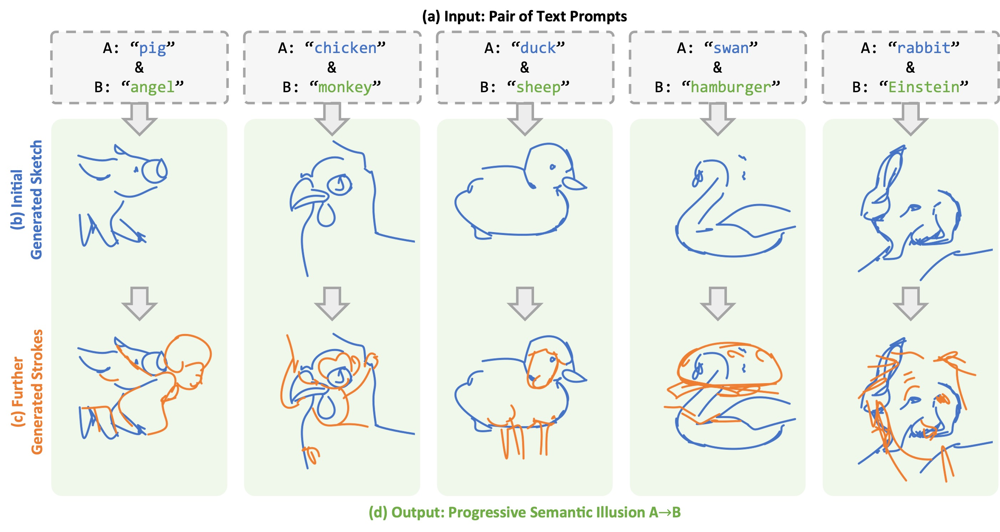

# Stroke of Surprise: Progressive Semantic Illusions in Vector Sketching

<p align="center">

</p>

_Stroke of Surprise generates vector sketches that progressively transform from one semantic meaning to another as strokes are added. Our method creates illusion sketches where the same set of strokes reveals different interpretations at different stages of completion._

> Visual illusions traditionally rely on spatial manipulations such as multi-view consistency. In this work, we introduce Progressive Semantic Illusions, a novel vector sketching task where a single sketch undergoes a dramatic semantic transformation through the sequential addition of strokes. We present **Stroke of Surprise**, a generative framework that optimizes vector strokes to satisfy distinct semantic interpretations at different drawing stages. The core challenge lies in the ''dual-constraint'': initial prefix strokes must form a coherent object (e.g., a duck) while simultaneously serving as the structural foundation for a second concept (e.g., a sheep) upon adding delta strokes. To address this, we propose a sequence-aware joint optimization framework driven by a dual-branch Score Distillation Sampling (SDS) mechanism. Unlike sequential approaches that freeze the initial state, our method dynamically adjusts prefix strokes to discover a ''common structural subspace'' valid for both targets. Furthermore, we introduce a novel Overlay Loss that enforces spatial complementarity, ensuring structural integration rather than occlusion. Extensive experiments demonstrate that our method significantly outperforms state-of-the-art baselines in recognizability and illusion strength, successfully expanding visual anagrams from the spatial to the temporal dimension.

<a href="docs/stroke_of_surprise_paper.pdf"></a>

<!-- <a href="https://arxiv.org/XXXXX"></a> -->

<a href="https://stroke-of-surprise.github.io/"></a>

## 🔥 NEWS

## Table of Contents

- [Installation](#installation)
- [Usage](#usage)
  - [Bezier Painter](#bezier-painter)
  - [B-spline Painter](#b-spline-painter)
  - [Neural Painter](#neural-painter)
  <!-- - [Multi-phase Illusions](#multi-phase-illusions) -->
- [Configuration](#configuration)
- [Citation](#citation)

## Installation

### Step 0 - Activate the sketch-illusions environment

```bash
conda create -n sketch-of-surprise python=3.9 -y
conda activate sketch-of-surprise
```

### Step 1 - Install `diffvg`

Please follow their [installation guide](https://github.com/BachiLi/diffvg?tab=readme-ov-file#install).

### Step 2 - Install requirements

```bash
pip install -r requirements.txt
```

### Step 3 - Download LoRAs (Optional, for Neural painter)

```bash
# Make sure you are in the correct directory
# If lora_weights folder doesn't exist, create it
cd ./lora_weights/

# Download using HF's CLI
huggingface-cli download SagiPolaczek/SD2.1-NeuralSVG-LoRAs lora_weights_sd21b_bg_color.safetensors lora_weights_sd21b_bg_color_colorful.safetensors lora_weights_sd21b_sketches.safetensors --local-dir .
```

## Usage

### Bezier Painter

Generate a 2-phase illusion sketch using Bezier curves:

```bash
python scripts/train.py \
    --config_path config_files/defaults/bezier_2phase.yaml \
    --data.caption_A "a chicken" \
    --data.caption_B "a monkey"
```

Or use the provided script:

```bash
bash scripts/run_bezier.sh
```

### B-spline Painter

Generate sketches using B-splines with varying stroke widths:

```bash
python scripts/train.py \
    --config_path config_files/defaults/bspline_2phase.yaml \
    --data.caption_A "a duck" \
    --data.caption_B "a sheep"
```

Or use the provided script:

```bash
bash scripts/run_bspline.sh
```

### Neural Painter

Generate sketches using Neural MLP representation (inspired by NeuralSVG):

```bash
python scripts/train.py \
    --config_path config_files/defaults/neural_2phase.yaml \
    --data.caption_A "a rabbit" \
    --data.caption_B "an elephant"
```

Or use the provided script:

```bash
bash scripts/run_neural.sh
```

<!-- ### Multi-phase Illusions

Create 3-phase illusions (e.g., apple → angel → chef):

```bash
python scripts/train.py \
    --config_path config_files/defaults/bezier_3phase.yaml \
    --phases_json config_files/examples/apple+angel+chef.json
``` -->

### Tips

- **Seed** - Different seeds result in different outcomes. Moreover, since we don't have control on the randomness of `diffvg`, exact reproducibility may not be guaranteed
- **Stroke counts** - Adjust `num_strokes` and phase `split_stroke_num` to control the transition points
- **Overlay loss** - Increase `overlay_loss_weight` to create cleaner separation between phases

## Configuration

The project uses YAML configuration files with support for command-line overrides. Key configuration areas:

- **Data**: Stroke counts, render size, captions for each phase
- **Optimization**: Learning rates, SDS guidance scale, overlay loss settings
- **Painter**: Painter-specific parameters (Bezier segments, B-spline degree, Neural MLP dimensions)
- **Logging**: Output directories, save intervals

Example configuration override:

```bash
python scripts/train.py \
    --config_path config_files/defaults/bezier_2phase.yaml \
    --data.caption_A "a cat" \
    --data.caption_B "a dog" \
    --optim.overlay_loss_weight 10.0
```

<!-- ## Citation

If you find this code useful for your research, please consider citing:

```
@article{strokeofsurprise,
    title={Stroke of Surprise: Progressive Semantic Illusions in Vector Sketching},
    author={},
    year={},
    journal={}
}
``` -->
